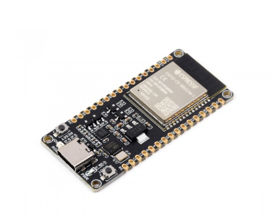

<h1> FINCALC PROTOTYPE 2</h1>
<h2>This project is a continuation of the FINCALC calculator series, designed for use on the ESP32 platform. FINCALC PROTOTYPE 2 aims to improve upon the features and functionalities of its predecessor, with enhanced user interaction and performance. </h2>

<h2>Link to predecessor</h2>

 You can find the predecessor project at the following link: https://github.com/Tofarati262/ESP32-C6-CALCULATOR 

<h3> Components</h3>

 Microcontroller 🎮 :https://www.waveshare.com/esp32-c6-dev-kit-n8.htm 

